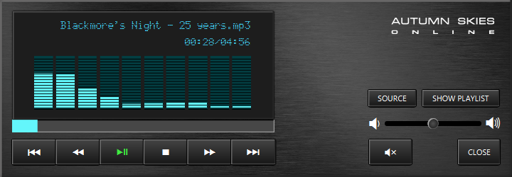

# 📀 MediaPlayerJavaFX  
*A standalone JavaFX MP3 player with a classic hi-fi component aesthetic*

---

## 📌 Project Overview
This project is the **first standalone module** of a planned modular **Media Player system**.  
It was developed as a full-featured JavaFX desktop application, combining robust playback logic with a custom-designed hi-fi inspired interface.

Key goals:
- Apply solid object-oriented principles and modular design  
- Build reusable components for future modules (video, image viewer, etc.)  
- Deliver a polished, visually distinctive desktop application

---

## 🖼️ Screenshots

**Early Layout (Initial Design)**  

**Final Player (Completed Phase 6)**  

---

## 🎨 Visual Design
- Inspired by classic **hi-fi component stacks**  
- **Brushed metal back panel** styled with CSS  
- **LED-style glow display** using custom font `MatrixCustom.ttf`  
- **Custom-designed control icons** created in CorelDRAW and FontForge  
- Subtle button press effects and color feedback for player state  
- Animated **EQ bars** using `AudioSpectrumListener`

---

## ✨ Features

- 🎵 **Core Playback Controls**
  - Play / Pause / Stop
  - Skip Back / Forward
  - Skip to Beginning / End
- 📊 **Progress & Time Display**
  - Real-time progress bar
  - Elapsed / Total time label
- 🔊 **Audio Controls**
  - Volume slider
  - Mute toggle
- 📋 **Playlist Management**
  - Create new playlists
  - Load, save, delete `.m3u` playlists
  - Append or replace tracks
  - Instant play (single) and instant batch play (multiple)
- 💡 **Visual & UI Design**
  - Animated EQ bars using `AudioSpectrumListener`
  - LED-style custom display font
  - Custom-designed icons and layout inspired by vintage hi-fi components
  - Fully styled via CSS

---

## 🖌️ Tools & Design Process

- **Icons and branding** created in CorelDRAW and FontForge  
- **Custom fonts** (`MediaPlayer.ttf` and `MatrixCustom.ttf`) designed for this project  
- Developed entirely from scratch as a standalone JavaFX desktop application

---

## ⚙️ Usage

1. **Load Tracks**
   - Click **SOURCE** → *Append Files* or *Replace Files* to add `.mp3` tracks.
   - Click **SOURCE** → *Load Playlist* to load an existing `.m3u` playlist.
2. **Play Music**
   - Use **Play/Pause**, **Stop**, **Skip** and **Seek** controls.
   - Click **SHOW PLAYLIST** to toggle the playlist panel.
3. **Volume & Mute**
   - Drag the **Volume slider** or click **Mute**.
4. **Instant Play**
   - Click **SOURCE** → *Instant Play* (single) or *Instant Batch* (multiple) to play files without affecting the main playlist.
5. **Exit**
   - Use the **CLOSE** button to safely stop playback and exit the app.

---

## 🚀 How to Run

1. Clone the repository:

       git clone https://github.com/aso-repos/MediaPlayerJavaFX.git

2. Open the project in **IntelliJ IDEA**

3. Configure JavaFX VM options:

       --module-path "C:/Java/javafx-sdk-21/lib" --add-modules javafx.controls,javafx.fxml

4. Run `Main.java`

The MP3 player window will open with the full hi-fi styled interface.

---

## 💻 Development Environment

- **Language:** Java (JDK 21.0.7, ZuluFX)
- **Framework:** JavaFX 21
- **IDE:** IntelliJ IDEA Community 2024.1.7
- **UI Builder:** Gluon Scene Builder 21
- **Version Control:** Git + GitHub

---

## 🚀 Future Vision

This MP3 player forms the **first standalone module** of a planned modular **Media Player system**.  
Planned future modules include:

- Video player  
- Image viewer  
- Metadata panels  
- Audio visualizer upgrades (waveforms, themes)  
- Marquee scrolling for long track titles  
